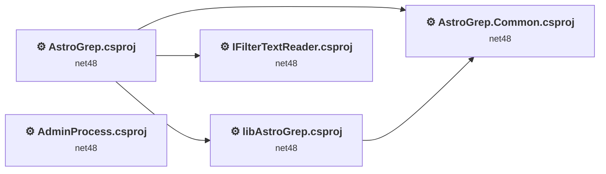
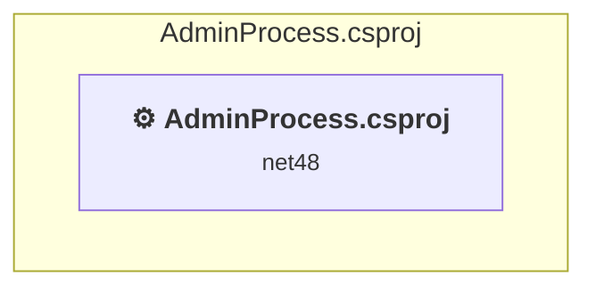
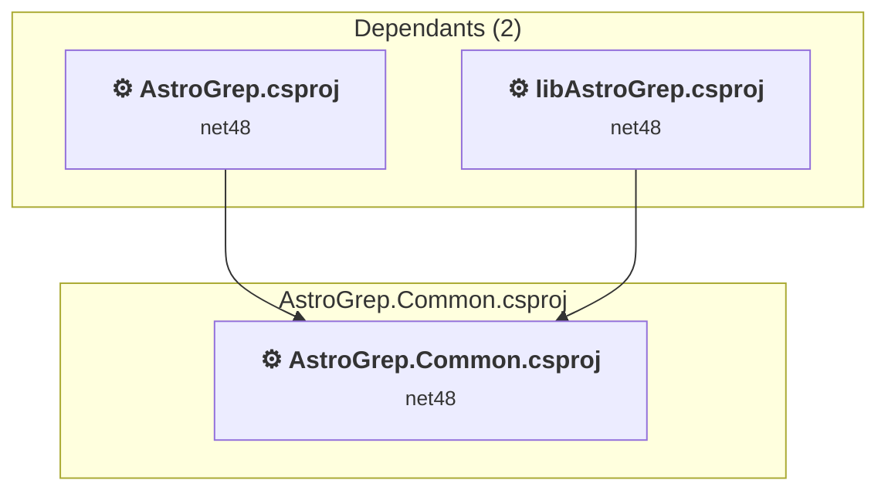
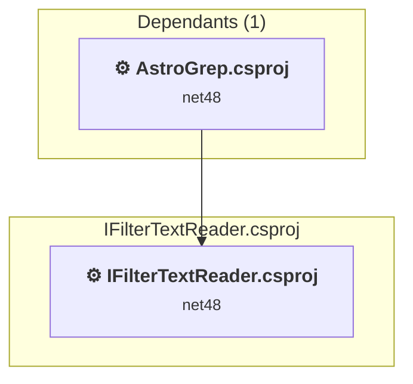
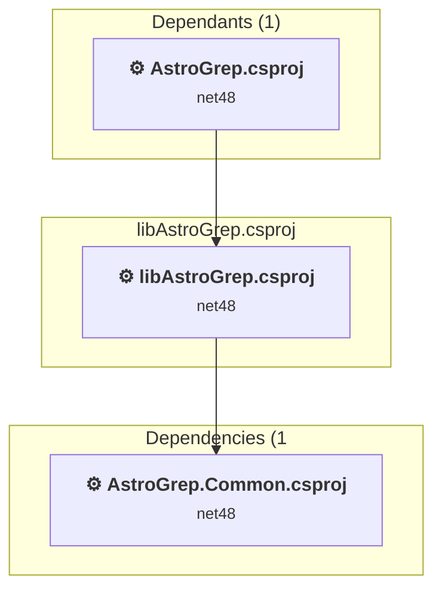
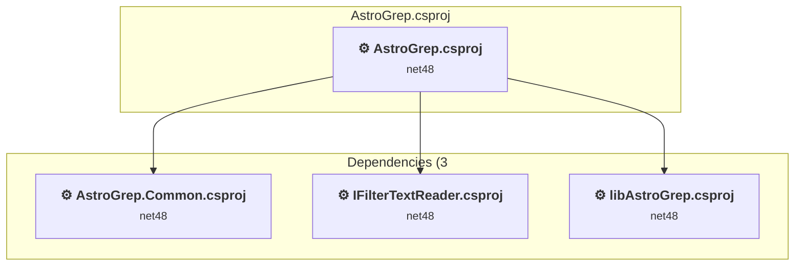

# Projects and dependencies analysis

This document provides a comprehensive overview of the projects and their dependencies in the context of upgrading to .NETCoreApp,Version=v10.0.

## Table of Contents

- [Executive Summary](#executive-Summary)
  - [Highlevel Metrics](#highlevel-metrics)
  - [Projects Compatibility](#projects-compatibility)
  - [Package Compatibility](#package-compatibility)
  - [API Compatibility](#api-compatibility)
  - [Binding Redirect Configuration](#binding-redirect-configuration)
- [Aggregate NuGet packages details](#aggregate-nuget-packages-details)
- [Top API Migration Challenges](#top-api-migration-challenges)
  - [Technologies and Features](#technologies-and-features)
  - [Most Frequent API Issues](#most-frequent-api-issues)
- [Projects Relationship Graph](#projects-relationship-graph)
- [Project Details](#project-details)

  - [AdminProcess\AdminProcess.csproj](#adminprocessadminprocesscsproj)
  - [AstroGrep.Common\AstroGrep.Common.csproj](#astrogrepcommonastrogrepcommoncsproj)
  - [IFilterTextReader\IFilterTextReader.csproj](#ifiltertextreaderifiltertextreadercsproj)
  - [libAstroGrep\libAstroGrep.csproj](#libastrogreplibastrogrepcsproj)
  - [WinformsGUI\AstroGrep.csproj](#winformsguiastrogrepcsproj)

## Executive Summary

### Highlevel Metrics

| Metric | Count | Status |
| :--- | :---: | :--- |
| Total Projects | 5 | All require upgrade |
| Total NuGet Packages | 8 | All compatible |
| Total Code Files | 230 |  |
| Total Code Files with Incidents | 84 |  |
| Total Lines of Code | 60248 |  |
| Total Number of Issues | 15683 |  |
| Estimated LOC to modify | 15666+ | at least 26.0% of codebase |

### Projects Compatibility

| Project | Target Framework | Difficulty | Package Issues | API Issues | Binding Issues | Est. LOC Impact | Description |
| :--- | :---: | :---: | :---: | :---: | :---: | :---: | :--- |
| [AdminProcess\AdminProcess.csproj](#adminprocessadminprocesscsproj) | net48 | 🟢 Low | 0 | 0 | 0 |  | ClassicDotNetApp, Sdk Style = False |
| [AstroGrep.Common\AstroGrep.Common.csproj](#astrogrepcommonastrogrepcommoncsproj) | net48 | 🟢 Low | 0 | 0 | 0 |  | ClassicClassLibrary, Sdk Style = False |
| [IFilterTextReader\IFilterTextReader.csproj](#ifiltertextreaderifiltertextreadercsproj) | net48 | 🟢 Low | 0 | 20 | 0 | 20+ | ClassicClassLibrary, Sdk Style = False |
| [libAstroGrep\libAstroGrep.csproj](#libastrogreplibastrogrepcsproj) | net48 | 🟢 Low | 0 | 8 | 0 | 8+ | ClassicClassLibrary, Sdk Style = False |
| [WinformsGUI\AstroGrep.csproj](#winformsguiastrogrepcsproj) | net48 | 🟡 Medium | 0 | 15638 | 7 | 15638+ | ClassicWpf, Sdk Style = False |

### Package Compatibility

| Status | Count | Percentage |
| :--- | :---: | :---: |
| ✅ Compatible | 8 | 100.0% |
| ⚠️ Incompatible | 0 | 0.0% |
| 🔄 Upgrade Recommended | 0 | 0.0% |
| ***Total NuGet Packages*** | ***8*** | ***100%*** |

### API Compatibility

| Category | Count | Impact |
| :--- | :---: | :--- |
| 🔴 Binary Incompatible | 14748 | High - Require code changes |
| 🟡 Source Incompatible | 912 | Medium - Needs re-compilation and potential conflicting API error fixing |
| 🔵 Behavioral change | 6 | Low - Behavioral changes that may require testing at runtime |
| ✅ Compatible | 34116 |  |
| ***Total APIs Analyzed*** | ***49782*** |  |

### Binding Redirect Configuration

| Severity | Count | Description |
| :--- | :---: | :--- |
| 🔴Mandatory | 1 | Must be fixed to avoid runtime failures |
| 🟡Potential | 6 | May cause issues in certain scenarios |
| ***Total Binding Issues*** | ***7*** | ***Across 1 project(s)*** |

## Aggregate NuGet packages details

| Package | Current Version | Suggested Version | Projects | Description |
| :--- | :---: | :---: | :--- | :--- |
| AvalonEdit | 6.1.3.50 |  | [AstroGrep.csproj](#winformsguiastrogrepcsproj) | ✅Compatible |
| CommandLineParser | 2.9.1 |  | [AstroGrep.csproj](#winformsguiastrogrepcsproj) | ✅Compatible |
| DocumentFormat.OpenXml | 2.17.1 |  | [AstroGrep.csproj](#winformsguiastrogrepcsproj) | ✅Compatible |
| ExcelDataReader | 3.6.0 |  | [AstroGrep.csproj](#winformsguiastrogrepcsproj) | ✅Compatible |
| ExcelNumberFormat | 1.1.0 |  | [AstroGrep.csproj](#winformsguiastrogrepcsproj) | ✅Compatible |
| NLog | 5.0.2 |  | [AstroGrep.Common.csproj](#astrogrepcommonastrogrepcommoncsproj) [AstroGrep.csproj](#winformsguiastrogrepcsproj) [libAstroGrep.csproj](#libastrogreplibastrogrepcsproj) | ✅Compatible |
| SharpZipLib | 1.3.3 |  | [AstroGrep.csproj](#winformsguiastrogrepcsproj) | ✅Compatible |
| TagLibSharp | 2.2.0 |  | [AstroGrep.csproj](#winformsguiastrogrepcsproj) | ✅Compatible |

## Top API Migration Challenges

### Technologies and Features

| Technology | Issues | Percentage | Migration Path |
| :--- | :---: | :---: | :--- |
| Windows Forms | 14374 | 91.8% | Windows Forms APIs for building Windows desktop applications with traditional Forms-based UI that are available in .NET on Windows. Enable Windows Desktop support: Option 1 (Recommended): Target net9.0-windows; Option 2: Add <UseWindowsDesktop>true</UseWindowsDesktop>; Option 3 (Legacy): Use Microsoft.NET.Sdk.WindowsDesktop SDK. |
| GDI+ / System.Drawing | 882 | 5.6% | System.Drawing APIs for 2D graphics, imaging, and printing that are available via NuGet package System.Drawing.Common. Note: Not recommended for server scenarios due to Windows dependencies; consider cross-platform alternatives like SkiaSharp or ImageSharp for new code. |
| WPF (Windows Presentation Foundation) | 285 | 1.8% | WPF APIs for building Windows desktop applications with XAML-based UI that are available in .NET on Windows. WPF provides rich desktop UI capabilities with data binding and styling. Enable Windows Desktop support: Option 1 (Recommended): Target net9.0-windows; Option 2: Add <UseWindowsDesktop>true</UseWindowsDesktop>. |
| Windows Forms Legacy Controls | 88 | 0.6% | Legacy Windows Forms controls that have been removed from .NET Core/5+ including StatusBar, DataGrid, ContextMenu, MainMenu, MenuItem, and ToolBar. These controls were replaced by more modern alternatives. Use ToolStrip, MenuStrip, ContextMenuStrip, and DataGridView instead. |
| Deprecated Remoting & Serialization | 2 | 0.0% | Legacy .NET Remoting, BinaryFormatter, and related serialization APIs that are deprecated and removed for security reasons. Remoting provided distributed object communication but had significant security vulnerabilities. Migrate to gRPC, HTTP APIs, or modern serialization (System.Text.Json, protobuf). |
| Windows Registry | 1 | 0.0% | APIs for accessing the Windows Registry that are available via NuGet package Microsoft.Win32.Registry. The Registry APIs have been moved to a separate package for better platform separation. Windows-only feature - install the Microsoft.Win32.Registry package. |

### Most Frequent API Issues

| API | Count | Percentage | Category |
| :--- | :---: | :---: | :--- |
| T:System.Windows.Forms.AnchorStyles | 711 | 4.5% | Binary Incompatible |
| T:System.Windows.Forms.Label | 622 | 4.0% | Binary Incompatible |
| T:System.Windows.Forms.Button | 566 | 3.6% | Binary Incompatible |
| T:System.Windows.Forms.ToolStripMenuItem | 481 | 3.1% | Binary Incompatible |
| T:System.Windows.Forms.ListView | 460 | 2.9% | Binary Incompatible |
| T:System.Windows.Forms.CheckBox | 325 | 2.1% | Binary Incompatible |
| T:System.Windows.Forms.ComboBox | 258 | 1.6% | Binary Incompatible |
| P:System.Windows.Forms.Control.Name | 237 | 1.5% | Binary Incompatible |
| T:System.Windows.Forms.ColumnHeader | 211 | 1.3% | Binary Incompatible |
| T:System.Windows.Forms.ToolStripButton | 209 | 1.3% | Binary Incompatible |
| T:System.Windows.Forms.Control.ControlCollection | 207 | 1.3% | Binary Incompatible |
| P:System.Windows.Forms.Control.Controls | 207 | 1.3% | Binary Incompatible |
| P:System.Windows.Forms.Control.Size | 202 | 1.3% | Binary Incompatible |
| M:System.Windows.Forms.Control.ControlCollection.Add(System.Windows.Forms.Control) | 199 | 1.3% | Binary Incompatible |
| P:System.Windows.Forms.Control.Location | 195 | 1.2% | Binary Incompatible |
| T:System.Windows.Forms.FlatStyle | 195 | 1.2% | Binary Incompatible |
| P:System.Windows.Forms.Control.TabIndex | 190 | 1.2% | Binary Incompatible |
| T:System.Windows.Forms.Panel | 183 | 1.2% | Binary Incompatible |
| T:System.Windows.Forms.DialogResult | 181 | 1.2% | Binary Incompatible |
| T:System.Drawing.ContentAlignment | 174 | 1.1% | Source Incompatible |
| T:System.Windows.Forms.GroupBox | 145 | 0.9% | Binary Incompatible |
| T:System.Windows.Forms.Keys | 133 | 0.8% | Binary Incompatible |
| T:System.Windows.Forms.ListViewItem | 131 | 0.8% | Binary Incompatible |
| T:System.Windows.Forms.TextBox | 116 | 0.7% | Binary Incompatible |
| P:System.Windows.Forms.Control.Anchor | 111 | 0.7% | Binary Incompatible |
| T:System.Windows.Forms.LinkLabel | 108 | 0.7% | Binary Incompatible |
| T:System.Windows.Forms.ToolStripSeparator | 100 | 0.6% | Binary Incompatible |
| T:System.Drawing.Font | 96 | 0.6% | Source Incompatible |
| F:System.Windows.Forms.AnchorStyles.Right | 96 | 0.6% | Binary Incompatible |
| T:System.Windows.Forms.TabPage | 95 | 0.6% | Binary Incompatible |
| T:System.Windows.Forms.ListView.ColumnHeaderCollection | 93 | 0.6% | Binary Incompatible |
| P:System.Windows.Forms.ListView.Columns | 93 | 0.6% | Binary Incompatible |
| T:System.Windows.Forms.VisualStyles.PushButtonState | 91 | 0.6% | Binary Incompatible |
| T:System.Windows.Forms.ListView.ListViewItemCollection | 87 | 0.6% | Binary Incompatible |
| P:System.Windows.Forms.ListView.Items | 87 | 0.6% | Binary Incompatible |
| P:System.Windows.Forms.ToolStripItem.Text | 87 | 0.6% | Binary Incompatible |
| F:System.Windows.Forms.AnchorStyles.Top | 82 | 0.5% | Binary Incompatible |
| T:System.Windows.Forms.ListView.SelectedListViewItemCollection | 81 | 0.5% | Binary Incompatible |
| P:System.Windows.Forms.ListView.SelectedItems | 81 | 0.5% | Binary Incompatible |
| T:System.Drawing.Bitmap | 80 | 0.5% | Source Incompatible |
| T:System.Windows.Forms.NumericUpDown | 80 | 0.5% | Binary Incompatible |
| F:System.Windows.Forms.AnchorStyles.Left | 80 | 0.5% | Binary Incompatible |
| T:System.Windows.Forms.ListViewItem.ListViewSubItemCollection | 80 | 0.5% | Binary Incompatible |
| P:System.Windows.Forms.ListViewItem.SubItems | 80 | 0.5% | Binary Incompatible |
| P:System.Windows.Forms.ListView.ColumnHeaderCollection.Item(System.Int32) | 80 | 0.5% | Binary Incompatible |
| P:System.Windows.Forms.ToolStripItem.Name | 80 | 0.5% | Binary Incompatible |
| P:System.Windows.Forms.ToolStripItem.Size | 79 | 0.5% | Binary Incompatible |
| T:System.Windows.Forms.MessageBoxIcon | 78 | 0.5% | Binary Incompatible |
| T:System.Windows.Forms.MessageBoxButtons | 78 | 0.5% | Binary Incompatible |
| P:System.Windows.Forms.Label.Text | 76 | 0.5% | Binary Incompatible |

## Projects Relationship Graph

Legend:
📦 SDK-style project
⚙️ Classic project

## Project Details

### AdminProcess\AdminProcess.csproj

#### Project Info

- **Current Target Framework:** net48
- **Proposed Target Framework:** net10.0
- **SDK-style**: False
- **Project Kind:** ClassicDotNetApp
- **Dependencies**: 0
- **Dependants**: 0
- **Number of Files**: 4
- **Number of Files with Incidents**: 1
- **Lines of Code**: 181
- **Estimated LOC to modify**: 0+ (at least 0.0% of the project)

#### Dependency Graph

Legend:
📦 SDK-style project
⚙️ Classic project

### API Compatibility

| Category | Count | Impact |
| :--- | :---: | :--- |
| 🔴 Binary Incompatible | 0 | High - Require code changes |
| 🟡 Source Incompatible | 0 | Medium - Needs re-compilation and potential conflicting API error fixing |
| 🔵 Behavioral change | 0 | Low - Behavioral changes that may require testing at runtime |
| ✅ Compatible | 100 |  |
| ***Total APIs Analyzed*** | ***100*** |  |

### AstroGrep.Common\AstroGrep.Common.csproj

#### Project Info

- **Current Target Framework:** net48
- **Proposed Target Framework:** net10.0
- **SDK-style**: False
- **Project Kind:** ClassicClassLibrary
- **Dependencies**: 0
- **Dependants**: 2
- **Number of Files**: 8
- **Number of Files with Incidents**: 1
- **Lines of Code**: 482
- **Estimated LOC to modify**: 0+ (at least 0.0% of the project)

#### Dependency Graph

Legend:
📦 SDK-style project
⚙️ Classic project

### API Compatibility

| Category | Count | Impact |
| :--- | :---: | :--- |
| 🔴 Binary Incompatible | 0 | High - Require code changes |
| 🟡 Source Incompatible | 0 | Medium - Needs re-compilation and potential conflicting API error fixing |
| 🔵 Behavioral change | 0 | Low - Behavioral changes that may require testing at runtime |
| ✅ Compatible | 215 |  |
| ***Total APIs Analyzed*** | ***215*** |  |

### IFilterTextReader\IFilterTextReader.csproj

#### Project Info

- **Current Target Framework:** net48
- **Proposed Target Framework:** net10.0
- **SDK-style**: False
- **Project Kind:** ClassicClassLibrary
- **Dependencies**: 0
- **Dependants**: 1
- **Number of Files**: 24
- **Number of Files with Incidents**: 11
- **Lines of Code**: 7369
- **Estimated LOC to modify**: 20+ (at least 0.3% of the project)

#### Dependency Graph

Legend:
📦 SDK-style project
⚙️ Classic project

### API Compatibility

| Category | Count | Impact |
| :--- | :---: | :--- |
| 🔴 Binary Incompatible | 0 | High - Require code changes |
| 🟡 Source Incompatible | 20 | Medium - Needs re-compilation and potential conflicting API error fixing |
| 🔵 Behavioral change | 0 | Low - Behavioral changes that may require testing at runtime |
| ✅ Compatible | 5840 |  |
| ***Total APIs Analyzed*** | ***5860*** |  |

### libAstroGrep\libAstroGrep.csproj

#### Project Info

- **Current Target Framework:** net48
- **Proposed Target Framework:** net10.0
- **SDK-style**: False
- **Project Kind:** ClassicClassLibrary
- **Dependencies**: 1
- **Dependants**: 1
- **Number of Files**: 97
- **Number of Files with Incidents**: 6
- **Lines of Code**: 16746
- **Estimated LOC to modify**: 8+ (at least 0.0% of the project)

#### Dependency Graph

Legend:
📦 SDK-style project
⚙️ Classic project

### API Compatibility

| Category | Count | Impact |
| :--- | :---: | :--- |
| 🔴 Binary Incompatible | 2 | High - Require code changes |
| 🟡 Source Incompatible | 6 | Medium - Needs re-compilation and potential conflicting API error fixing |
| 🔵 Behavioral change | 0 | Low - Behavioral changes that may require testing at runtime |
| ✅ Compatible | 8789 |  |
| ***Total APIs Analyzed*** | ***8797*** |  |

#### Project Technologies and Features

| Technology | Issues | Percentage | Migration Path |
| :--- | :---: | :---: | :--- |
| Deprecated Remoting & Serialization | 2 | 25.0% | Legacy .NET Remoting, BinaryFormatter, and related serialization APIs that are deprecated and removed for security reasons. Remoting provided distributed object communication but had significant security vulnerabilities. Migrate to gRPC, HTTP APIs, or modern serialization (System.Text.Json, protobuf). |

### WinformsGUI\AstroGrep.csproj

#### Project Info

- **Current Target Framework:** net48
- **Proposed Target Framework:** net10.0-windows
- **SDK-style**: False
- **Project Kind:** ClassicWpf
- **Dependencies**: 3
- **Dependants**: 0
- **Number of Files**: 133
- **Number of Files with Incidents**: 65
- **Lines of Code**: 35470
- **Estimated LOC to modify**: 15638+ (at least 44.1% of the project)

#### Dependency Graph

Legend:
📦 SDK-style project
⚙️ Classic project

### API Compatibility

| Category | Count | Impact |
| :--- | :---: | :--- |
| 🔴 Binary Incompatible | 14746 | High - Require code changes |
| 🟡 Source Incompatible | 886 | Medium - Needs re-compilation and potential conflicting API error fixing |
| 🔵 Behavioral change | 6 | Low - Behavioral changes that may require testing at runtime |
| ✅ Compatible | 19172 |  |
| ***Total APIs Analyzed*** | ***34810*** |  |

#### Binding Redirect Configuration

| Rule | Severity | Details | Recommendation |
| :--- | :---: | :--- | :--- |
| Missing binding redirect for referenced assembly | 🟡Potential | Manual redirects exist but none covers DocumentFormat.OpenXml (referenced v2.17.1.0, package v2.17.1) | Add a binding redirect for the missing assembly. |
| Missing binding redirect for referenced assembly | 🟡Potential | Manual redirects exist but none covers ExcelDataReader (referenced v3.6.0.0, package v3.6.0) | Add a binding redirect for the missing assembly. |
| Missing binding redirect for referenced assembly | 🟡Potential | Manual redirects exist but none covers ExcelNumberFormat (referenced v1.1.0.0, package v1.1.0) | Add a binding redirect for the missing assembly. |
| Missing binding redirect for referenced assembly | 🟡Potential | Manual redirects exist but none covers NLog (referenced v5.0.0.0, package v5.0.2) | Add a binding redirect for the missing assembly. |
| Missing binding redirect for referenced assembly | 🟡Potential | Manual redirects exist but none covers TagLibSharp (referenced v2.2.0.0, package v2.2.0) | Add a binding redirect for the missing assembly. |
| Binding redirect forces version downgrade | 🟡Potential | Binding redirect for ICSharpCode.SharpZipLib targets 1.2.0.246 but reference requires 1.3.3.11 | Update the binding redirect newVersion to match the version provided by the NuGet package. |
| Assembly version mismatch with insufficient redirect coverage | 🔴Mandatory | Redirect for ICSharpCode.SharpZipLib has oldVersion="0.0.0.0-1.2.0.246" which does not cover referenced version 1.3.3.11 | Add or update binding redirect with oldVersion="0.0.0.0-{TargetVersion}" newVersion="{TargetVersion}". |

#### Project Technologies and Features

| Technology | Issues | Percentage | Migration Path |
| :--- | :---: | :---: | :--- |
| WPF (Windows Presentation Foundation) | 285 | 1.8% | WPF APIs for building Windows desktop applications with XAML-based UI that are available in .NET on Windows. WPF provides rich desktop UI capabilities with data binding and styling. Enable Windows Desktop support: Option 1 (Recommended): Target net9.0-windows; Option 2: Add <UseWindowsDesktop>true</UseWindowsDesktop>. |
| Windows Forms Legacy Controls | 88 | 0.6% | Legacy Windows Forms controls that have been removed from .NET Core/5+ including StatusBar, DataGrid, ContextMenu, MainMenu, MenuItem, and ToolBar. These controls were replaced by more modern alternatives. Use ToolStrip, MenuStrip, ContextMenuStrip, and DataGridView instead. |
| GDI+ / System.Drawing | 882 | 5.6% | System.Drawing APIs for 2D graphics, imaging, and printing that are available via NuGet package System.Drawing.Common. Note: Not recommended for server scenarios due to Windows dependencies; consider cross-platform alternatives like SkiaSharp or ImageSharp for new code. |
| Windows Forms | 14374 | 91.9% | Windows Forms APIs for building Windows desktop applications with traditional Forms-based UI that are available in .NET on Windows. Enable Windows Desktop support: Option 1 (Recommended): Target net9.0-windows; Option 2: Add <UseWindowsDesktop>true</UseWindowsDesktop>; Option 3 (Legacy): Use Microsoft.NET.Sdk.WindowsDesktop SDK. |
| Windows Registry | 1 | 0.0% | APIs for accessing the Windows Registry that are available via NuGet package Microsoft.Win32.Registry. The Registry APIs have been moved to a separate package for better platform separation. Windows-only feature - install the Microsoft.Win32.Registry package. |

